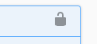

# Storm ID Tech Task

This is a multi-project .Net 6.0 project.  It consists of a web api project, based on [Clean Architecture](https://blog.cleancoder.com/uncle-bob/2012/08/13/the-clean-architecture.html) principles, and a simple Razor pages application to consume the api.  There is a unit test project, and an integration test project that hits the api endpoints.

The api is deliberately very simple, managing the creation and retrieval of a "Project" entity only.

Please push your work as commits to a user branch of this repository using the following branch naming convention:
`users/<<your GitHub username>>/submission`

Each commit you make should relate to a single task. A more complex task may have many commits; this is up to you.

:warning: Please do not submit a pull request for your branch.

The tasks below are not a test.  They are there to act as a discussion starter, to see what your approach to each problem might be.

## 1. Build the project
The solution should build on Windows, macOS or Linux.  It can be built using Visual Studio, or using the command line.

For the command line, a [Cake](https://cakebuild.net/) build file is included that can be run using:

```
dotnet tool restore
dotnet cake
```
This should build the project and run all the tests.


In Visual Studio, simply open the Solution file `Storm.TechTask.sln` and build the project, then run the tests.


>Possible discussion points:
>
> * What are your thoughts on the code?
> * What patterns can you identify?
> * What are the advantages / disadvantages of build tools like Cake?

## 2. Run the project

Run the project in Visual Studio, or alternatively individual projects can be run from the command line when required

Api:
```
dotnet run --project .\src\Storm.TechTask.Api\
```

Web:
```
dotnet run --project .\src\Storm.TechTask.Web\
```

The API project is available at https://localhost:5011.  You should see the Swagger API definitions for the endpoints

The Web project is available at https://localhost:5001.  If you want to run using different ports, you will need to change the application config settings that point to the API.

Try sending some API requests.  You could do this with a tool like [Postman](https://www.postman.com/) or [Insomnia](https://insomnia.rest/), or you can use the Swagger UI to send requests.  

The API is protected using [Identity Server 4](https://github.com/IdentityServer/IdentityServer4) with [Client Credentials](https://docs.identityserver.io/en/latest/quickstarts/1_client_credentials.html) flow.  In the Swagger UI, you will need to authenticate using the padlock icon.  The values for ClientId and ClientSecret are pre-populated, so you just need to `Authorize` and then you can send api messages.


 

For other REST API tools, you will need the following settings:

* Authentication: _OAuth2_
* Grant Type: _Client Credentials_
* Access token url: https://localhost:5011/connect/token
* Client Id: `26aca281-aad3-4de6-8633-b3295e36425e`
* Client Secret: `eb300de4-add9-42f4-a3ac-abd3c60f1919`

>Possible discussion points:
>
> * What other ways could an API be protected?
> * What are your thoughts about the documentation provided via Swagger?

## 3. Fix a bug

A client has reported that changing a project status to _Closed_ does not work.  This happens when the `Close()` method is called on the `Project` entity.  Add a unit test to replicate this issue, and then solve the simple bug. 

A shell of a unit test method has already been added in `ProjectTests.cs` to save you time.  Just uncomment the block of code.  You can use the other tests in the file as a reference.

>Possible discussion points:
>
> * Testing, unit tests vs integration tests vs functional tests?
> * Mocks, stubs etc.
> * Generation of test data

## 4. Add a missing test

In the integration tests project, there are Endpoint tests for the `List` and `Create` endpoints, but not for the `GetById` endpoint.  

Add a new test suite for the `GetById` endpoint.  The `List` tests will be a good reference point.

>Possible discussion points:
>
> * Integration testing with databases
> * Authentication and authorization for integration tests.

## 5. Update an endpoint

The `Create` endpoint for Projects currently returns `200 OK` after a successful submission.  This should really return `201 Created` instead.

Update the endpoint to return this status code instead. Make sure the Swagger documentation also reflects this change.

>Possible discussion points:
>
> * Integration testing with databases
> * Authentication and authorization for integration tests.
> * API design "best practices"

## 6. Add a new Project property

A project can have a list of "To Do" items.  Update the project so that the `GetById` endpoint returns these.

To save time, some code has already been added, but is commented out:

* The `ToDoItem` domain base entity in `Storm.TechTask.Core`
* The `Items` property on the `Project` entity
* Some data seeding of `TodoItem` in `SeedData.cs` (This will save you having to also add a method of adding new items.  Just delete the `database.sqlite` files and they will be recreated with the seeded values.)

You only need to add these to the API response.  Do not worry about adding them to the Web interface unless you want the additional challenge.

>Possible discussion points:
>
> * How do you deal with database changes and updates in a production system?
> * API versioning

## 7. Add a domain event

The `Project` entity also contains some commented out code for `AddItem` and `CompleteItem`.  The first of these raises a _Domain Event_.

Uncomment this code, and use this as a basis to add a new domain event for `CompleteItem`

>Possible discussion points:
>
> * What is the point of these events?
> * Where are they published?
> * Integration events vs domain events?
> * How do you handle these events?
> * What happens if a handler throws an exception?

## 8. Add your own code

Feel free make more updates or changes to the code if you want to demonstrate any favourite tools or techniques.  Or you could just make some notes and comments about how you might do things differently?

>Possible discussion points:
>
> * Dealing with external dependencies
> * Integration of design, or front-end code.
> * Deployment to Azure
> * DevOps pipelines


## References

This codebase references, and uses, code from a number of sources, such as:

* [Jason Taylor's Clean Architecture](https://github.com/jasontaylordev/CleanArchitecture)
* [Ardalis Clean Architecture](https://github.com/ardalis/CleanArchitecture)
